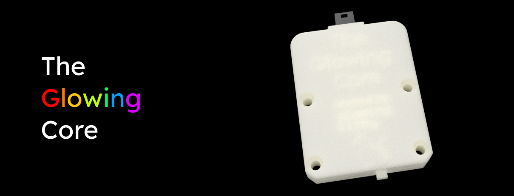
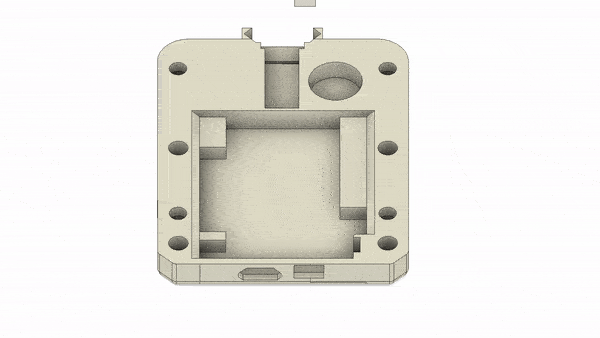
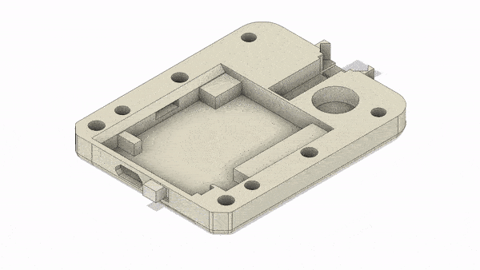
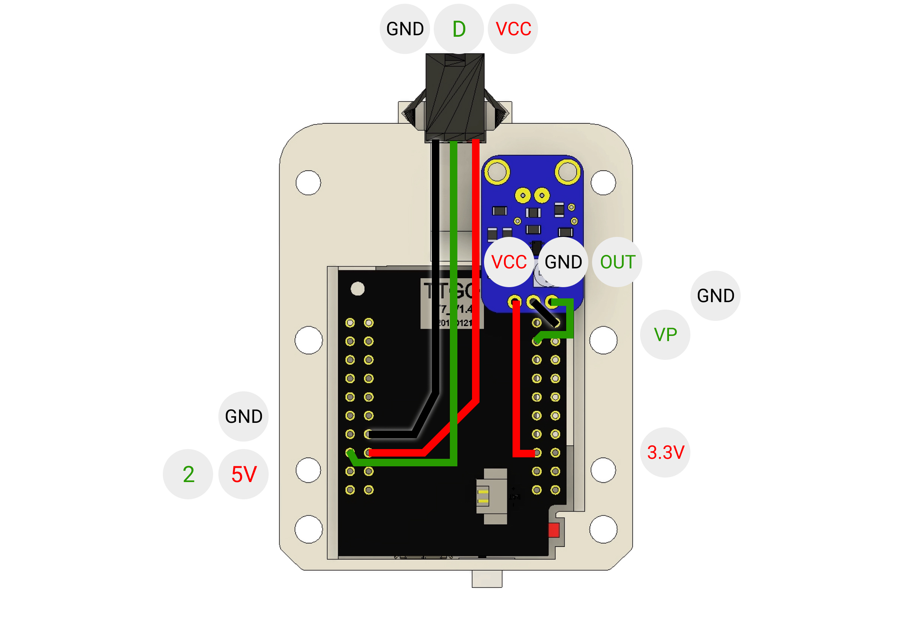
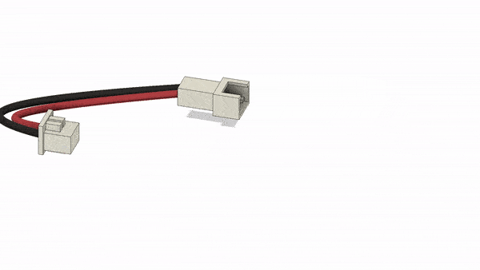
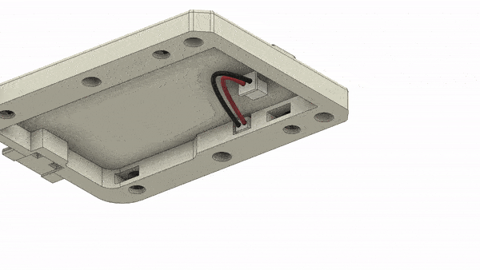
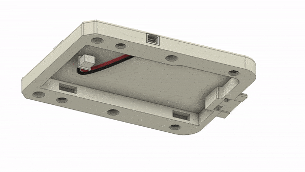
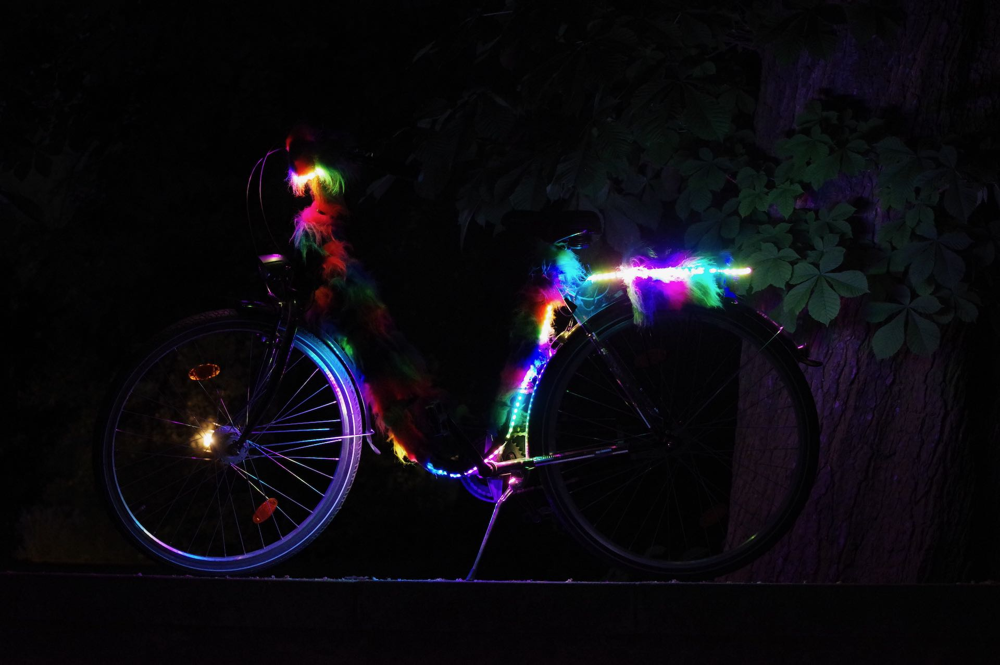

## What is this project?

The Glowing Core is a tiny package that allows you to easily build LED projects of all kind, with all the sensitive components protected in a case. Want to make an LED strip glow? Just connect the Glowing Core via the 3-pin connector to the LED strip, power the Glowing Core via MicroUSB or a lipo battery - and there you go, glowing LEDs!

What software does it run, you ask? A customized version of [WLED](https://github.com/atuline/WLED)! What is WLED? It's the most awesome open source software out there to control LED strips, create custom animations and more - using a web interface, physical buttons, the WLED API or even Alexa!

Do you already have a project that runs on a [supported microcontroller](https://github.com/Aircoookie/WLED/wiki/Compatible-hardware) and don't want to use the Glowing Core case? Fair enough - you can also just install the firmware (check the "**Step 3:** Install the Glowing Core firmware on your ESP32" part of this readme) and consider changing the LED strip pin in the settings via the web interface - and there you go!

## How to build the Glowing Core

### **Step 1:** 3D print the case parts

Select which version you want and print the files on an FDM (molten plastic) or SLA (resin) printer. The 3D files are tested with an Anycubic Photon Mono X (SLA printer), but should also work fine on a regular FDM printer.

#### **T7 edition, with connector for a lipo battery**

Download and print those STL files:

- 1x [Top case](https://github.com/glowingkitty/TheGlowingCore/blob/master/3d%20printed%20parts/T7%20edition/case_top.stl)
- 1x [Bottom case](https://github.com/glowingkitty/TheGlowingCore/blob/master/3d%20printed%20parts/T7%20edition/case_bottom.stl)
- 1x [Power switch](https://github.com/glowingkitty/TheGlowingCore/blob/master/3d%20printed%20parts/T7%20edition/case_power_button.stl)

#### **D1 edition**

Download and print those STL files:

- 1x [Top case](https://github.com/glowingkitty/TheGlowingCore/blob/master/3d%20printed%20parts/D1%20edition/case_top.stl)
- 1x [Bottom case](https://github.com/glowingkitty/TheGlowingCore/blob/master/3d%20printed%20parts/D1%20edition/case_bottom.stl)

### **Step 2:** Get all the other parts you need

Here is what you need:

**For the TTGO T7 version with connector for a lipo battery**

- 1x ESP32 TTGO T7
- 1x JST 1.25mm male cable
- 1x JST 1.25mm female cable

**For the D1 Mini version**

- 1x ESP32 D1 Mini

**And the rest...**

- 1x GY-MAX4466 microphone
- 1x 3-pin LED strip connector female (the same connector type basically every WS2812B led strip comes with)
- 3x wires (a few cm each is enough, for connecting the microphone to the ESP32)
- 4x M3 square nuts
- 4x M3 6mm screws

### **Step 3:** Install the Glowing Core firmware on your ESP32

Just take the [firmware.bin](https://github.com/glowingkitty/TheGlowingCore/blob/master/firmware.bin) and [install it to your ESP32](https://github.com/Aircoookie/WLED/wiki/Install-WLED-binary) - or [compile & upload the GlowingCore firmware specifically for your microcontroller](https://github.com/Aircoookie/WLED/wiki/Compiling-WLED).

### **Step 4:** (For TTGO T7 version) Add the power switch

### **Step 5:** Place the ESP32 board, microphone and 3-pin connector inside the bottom case

### **Step 6:** Solder all parts together

### **Step 7:** (For TTGO T7 version) Solder JST 1.25mm 2-pin cables together & place in in the top case

### **Step 8:** Add nuts in the top case case

### **Step 9:** Close the case and screw it together

### **Step 10:** Setup the software

Just connect your LED strip via the 3-pin connector, supply the Glowing Core with power (via Micro USB or if you use the TTGO T7 edition - using a lipo battery via the 1.25mm JST input), search for the "TheGlowingCore" wifi network, connect with it and continue the setup which should automatically pop up. If it doesn't pop up, open the URL [4.3.2.1](http://4.3.2.1) in your web browser.

### **Step 11:** Build cool stuff with LEDs and make the world glow
